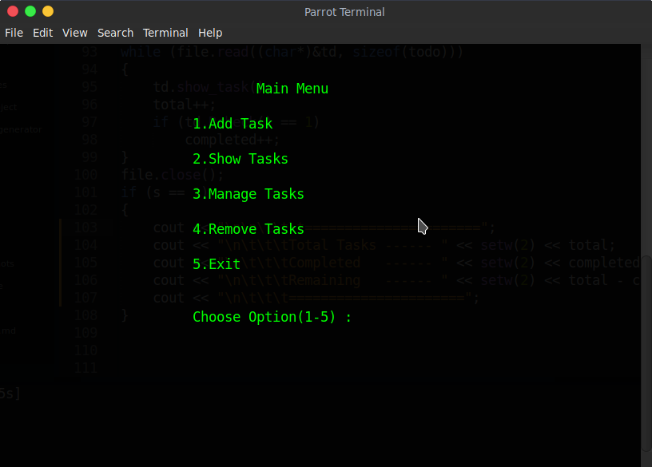
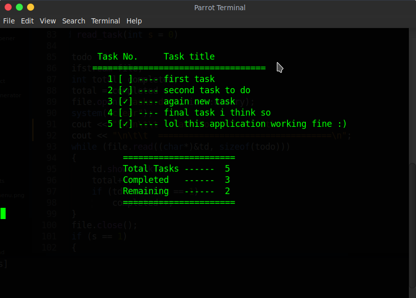
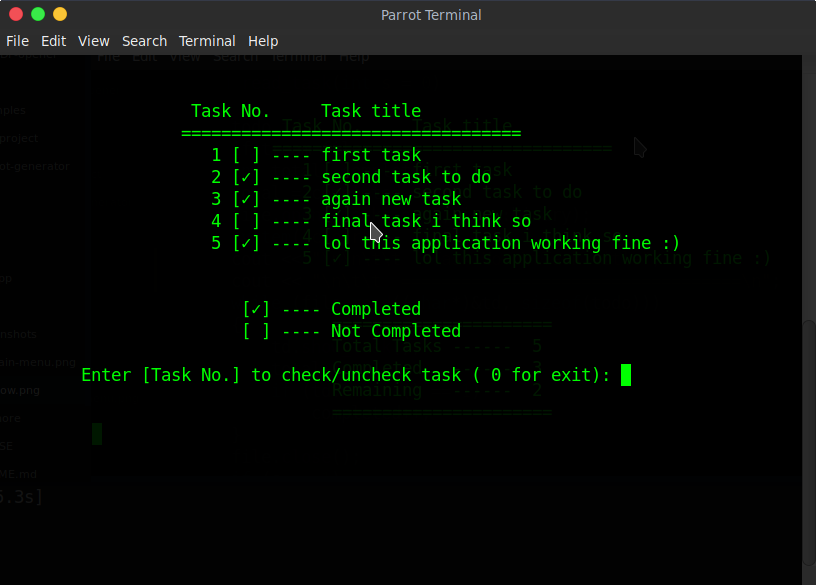
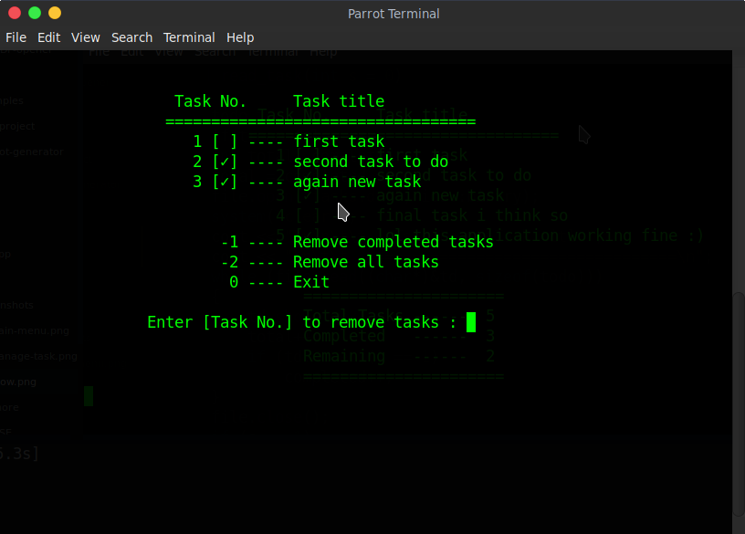

# Todo

A simple todo application

   
  
    

## Screeshots :

  
  
  
  
  
## More projects : 
   
  - [Virtual Assistant](https://github.com/vishal2376/virtual-assistant)
  - [C++ Mini Projects](https://github.com/vishal2376/cpp-mini-projects) 
  - [Password Generator](https://github.com/vishal2376/password-generator) 

## Contact :  
  - [Instagram](https://www.instagram.com/vishal_2376/)
  - [Telegram](https://t.me/vishal2376/)
